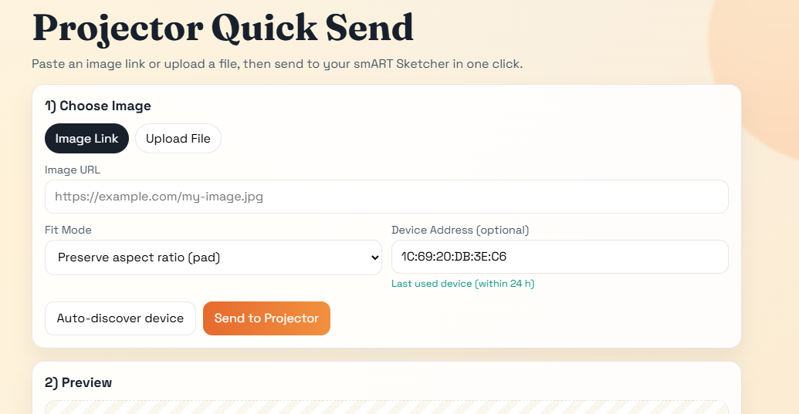

# Smart Sketcher Tools

A web app to publish images to the ***smART Sketcher Projecter 2.0***, forked from [megakode/smart-sketcher-tools](https://github.com/megakode/smart-sketcher-tools).

If you bought your kid the above mentioned device, you probably got really angry when you opened the app and discovered the outrages monthly prices they tried to get you to pay, just for a tiny bunch of clip art images, which there are thousands of freely available on the internet (i.e. http://clipart-library.com/).



# Usage

## Start web app

Install dependencies:

```bash
python -m pip install -r requirements.txt
```

Run server on your home network:

```bash
python webapp.py
```

Open:

```text
http://localhost:8000
```

From another device on the same network, open:

```text
http://<YOUR_PC_IP>:8000
```

### Web app flow

1. Paste an image link or choose upload.
2. Optionally provide Bluetooth address. If empty, app auto-discovers `smART_sketcher2.0`.
3. Click **Send to Projector**.
4. Watch live progress until all 128 lines are sent.

### Notes

- Uploaded/linked image is converted to projector format (160x128 RGB565).
- Default fit mode preserves aspect ratio and pads remaining area.
- Only one transfer runs at a time.

**Usage:**

`python3 sketcher.py sendimage dog.jpg`

This will automatically try to scan for a nearby device and send an image to it.

You can also specify the Bluetooth address directly (which is a lot faster):

`python3 sketcher.py --adr 11:22:33:44:55:66 sendimage dog.jpg`
